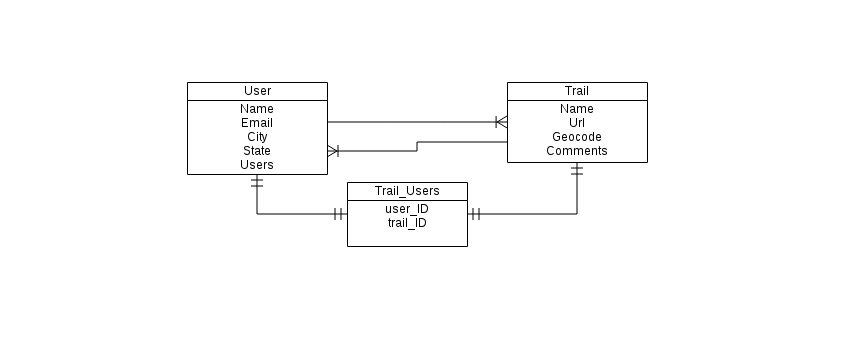

Wanderlust

wanderlust-trails.herokuapp.com
==
A rails app that allows users to search for hiking and biking trails

User Stories
--
Users should be able to:

 - sign up and log in
 - search trails by zip code, or city/state name
 - look at a list of trails with a link to the trail page
 - Make a new trail
 - favorite trails
 - follow other users
 - comment on trails
 - rate trails (5 stars)

Technologies Employed
--
 - Rails
 - Everytrail API (http://www.everytrail.com/developer)

Setup
--
	rake db:create
	rake db:migrate
	rake db:seed
 
ERD
--

